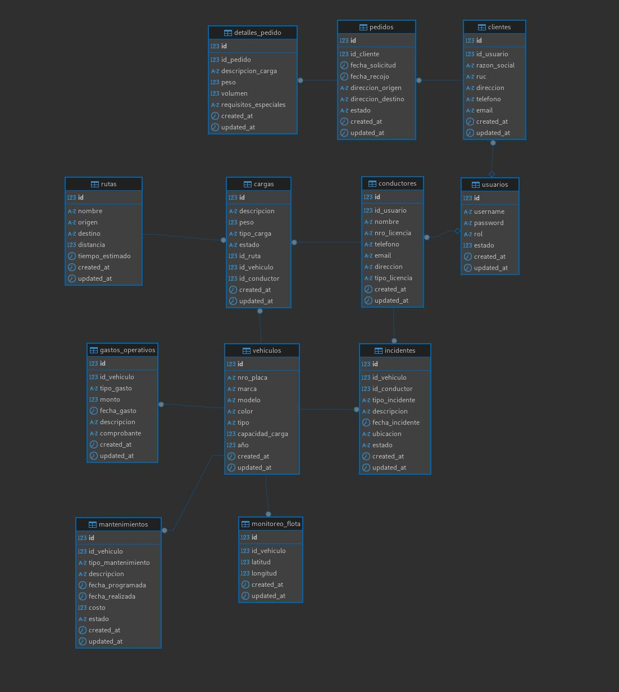

# Sistema de Gestión de Transporte
Repositorio para el proyecto final del curso Taller De Programación Web.

## Curso
 Taller De Programación Web

## Docente
 [Diego Fernando Baes Vasquez](https://github.com/diegobaesv)

## Tema
 Sistema de Gestión de Transporte

## Alcance del Proyecto
El sistema de gestión de transporte es una aplicación web diseñada para optimizar y automatizar las operaciones de empresas de transporte. El sistema aborda las siguientes áreas clave:

### Módulos Principales
- **Gestión de vehículos**
  - Registro y actualización de información de vehículos

- **Gestión de rutas**
  - Creación y modificación de rutas

- **Gestión de conductores**
  - Registro de conductores y datos personales

- **Gestión de cargas**
  - Registro de cargas y mercancías

- **Monitoreo de flota**
  - Seguimiento en tiempo real de vehículos

### Características Técnicas
- Interfaz web responsive
- Base de datos relacional
- Integración con mapas para seguimiento

## Integrantes
 - [Jose Carlos Yon](https://github.com/2017310708)

## Diseño de la BD

commit prueba cambio
